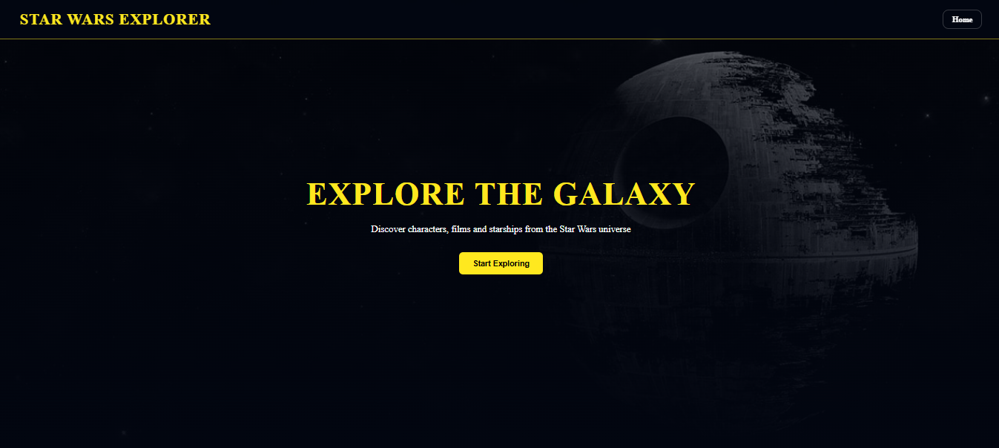

# 🚀 Star Wars API - Fullstack

API REST desenvolvida com Node.js, Express e MongoDB Atlas para gerenciamento de dados do universo Star Wars, com frontend em React para consumo dos dados.

---

## Application Preview




---

## 📌 Objetivo

Este projeto foi desenvolvido como parte da disciplina **Desenvolvimento Web III**, com o objetivo de criar uma API REST completa com integração ao MongoDB e consumo via frontend.

---

## 🛠️ Tecnologias utilizadas

### Backend

* Node.js
* Express
* MongoDB Atlas
* Mongoose
* Dotenv

### Frontend

* React
* Vite
* Axios

### Ferramentas

* Insomnia (testes de API)
* Git e GitHub
* MongoDB Compass

---

## 📂 Estrutura do projeto

```
ATV01_API_STAR_WARS/
│
├── backend-star-wars/
│   ├── models/
│   ├── routes/
│   ├── services/
│   ├── index.js
│   └── package.json
│
├── frontend-star-wars/
│   ├── src/
│   ├── components/
│   ├── pages/
│   └── package.json
│
├── package.json (raiz)
└── README.md
```

---

## ⚙️ Como executar o projeto

### 1. Clonar o repositório

```
git clone https://github.com/toledorp/ATV01_API_STAR_WARS
---

### 2. Instalar dependências

#### Backend

```
cd backend-star-wars
npm install
```

#### Frontend

```
cd ../frontend-star-wars
npm install
```

---

### 3. Configurar variáveis de ambiente

Crie um arquivo `.env` dentro da pasta **backend-star-wars**:

```
MONGO_URI=sua_string_do_mongodb_atlas
PORT=4000
```

---

### 4. Executar aplicação

Na raiz do projeto:

```
npm run dev
```

* Backend: http://localhost:4000
* Frontend: http://localhost:5173

---

## 🔗 Endpoints da API

### 🎬 Filmes

* GET `/films` → lista todos os filmes
* GET `/films/:id` → busca por id
* POST `/films` → cria filme
* PUT `/films/:id` → atualiza filme
* DELETE `/films/:id` → remove filme

---

### 👤 Personagens

* GET `/persons` → lista todos
* GET `/persons/:id` → busca por id
* POST `/persons` → cria personagem
* PUT `/persons/:id` → atualiza
* DELETE `/persons/:id` → remove

---

### 🌍 Planetas

* GET `/planets` → lista todos
* GET `/planets/:id` → busca por id
* POST `/planets` → cria planeta
* PUT `/planets/:id` → atualiza
* DELETE `/planets/:id` → remove

---

### 🧬 Species

* GET `/species` → lista todos
* GET `/species/:id` → busca por id
* POST `/species` → cria planeta
* PUT `/species/:id` → atualiza
* DELETE `/species/:id` → remove

---

### 🛸 Vehicles 

* GET `/vehicles` → lista todos
* GET `/vehicles/:id` → busca por id
* POST `/vehicles` → cria planeta
* PUT `/vehicles/:id` → atualiza
* DELETE `/vehicles/:id` → remove

---

### 🚀 Starships

* GET `/starships` → lista todos
* GET `/starships/:id` → busca por id
* POST `/starships` → cria planeta
* PUT `/starships/:id` → atualiza
* DELETE `/starships/:id` → remove


## 🧩 Exemplo de estrutura de dados (com aninhamento)

```
{
  "name": "C-3PO",
  "birth_year": "112BBY",
  "homeworld": "Tatooine",
  "species": "Droid",
  "descriptions": {
    "height": 167,
    "mass": 75,
    "hair_color": "n/a",
    "skin_color": "gold",
    "eye_color": "yellow",
    "gender": "n/a"
  }
}

```

✔️ Atende ao requisito de documento aninhado solicitado no trabalho.

---

## 🧪 Testes da API

Os testes foram realizados utilizando o **Insomnia**, validando todos os endpoints de CRUD (Create, Read, Update e Delete).

---

## ☁️ Banco de dados

O banco de dados está hospedado na nuvem utilizando o **MongoDB Atlas**.

---

## 🎨 Protótipo do Frontend

Adicionar aqui o link do Figma:

```
https://figma.com/seu-projeto
```

---

## 📸 Demonstração

### Tela inicial


### Dashboard


### Teste da API


## 🧠 Desafios enfrentados

* Configuração do MongoDB Atlas
* Conexão entre backend e banco de dados
* Estruturação de rotas REST
* Implementação do CRUD completo
* Integração entre frontend e backend
* Organização do projeto fullstack

---

## 📘 Documentação da API

A documentação pode ser acessada via Swagger (caso implementado):

```
http://localhost:4000/api-docs
```

---

## 👨‍💻 Autor(es)

* Camila Machado de Souza
* Ricardo Sugano
* Rogerio Pupo Toledo

---

## 📄 Licença

Este projeto é acadêmico e não possui fins comerciais.
